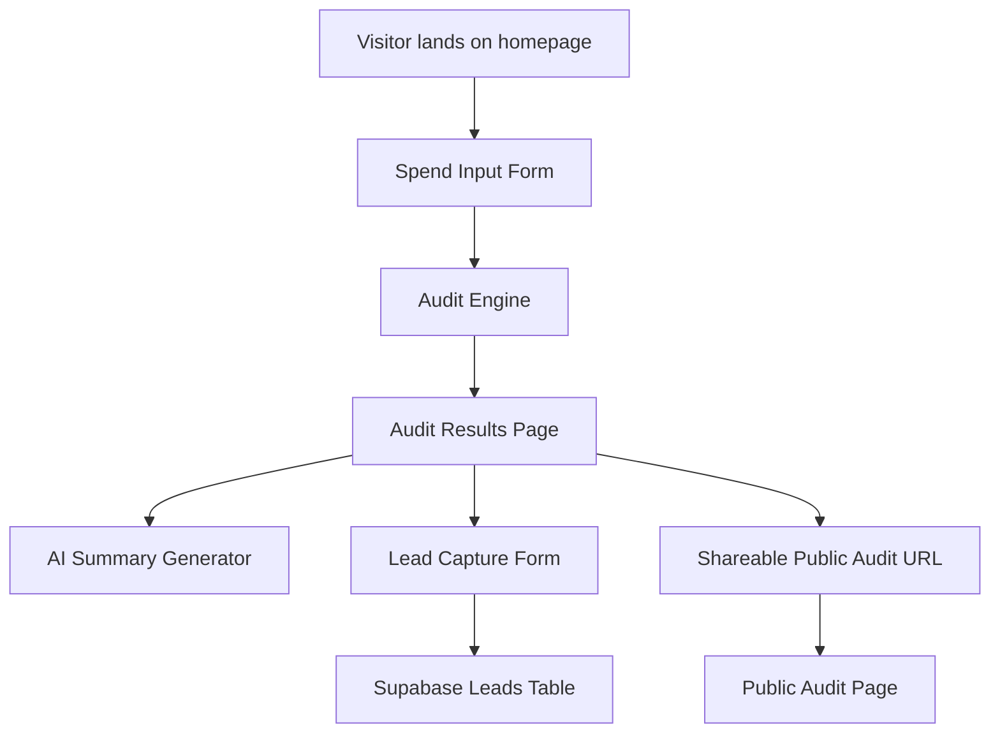

# ARCHITECTURE

## System Diagram

## Data Flow

1. A visitor opens the landing page and starts the audit.
2. The user enters AI tools, plan, monthly spend, number of seats, team size, and use case.
3. Form state persists locally so the user does not lose progress on reload.
4. The audit engine evaluates each tool using deterministic pricing and usage-fit rules.
5. The results page displays total monthly and annual savings.
6. A personalized summary is generated from the audit result, with fallback text if the AI provider fails.
7. After seeing value, the user can submit email, company, role, and team size.
8. Lead data is stored in Supabase.
9. Each audit can be opened through a public shareable URL.
10. Public audit pages strip identifying user details and only show tools, savings, and recommendations.

## Stack Choice

### Next.js
I chose Next.js because it supports routing, metadata, server/client components, and deployment to Vercel with minimal setup. It is also a practical choice for building a public SaaS-style MVP quickly.

### React
React made it easier to split the product into reusable components such as the spend form, audit results, and lead capture section.

### TypeScript
TypeScript was used because the audit engine deals with structured data and pricing logic. Types help reduce mistakes when handling tools, plans, spend, and recommendations.

### Tailwind CSS
Tailwind was chosen for fast styling without using a prebuilt website builder or admin dashboard template.

### Supabase
Supabase was used as the backend because it provides a real database, table editor, API access, and Row Level Security policies quickly.

### Vitest
Vitest was used for testing because the audit engine is pure logic and can be tested without rendering the full UI.

### GitHub Actions
GitHub Actions runs automated checks on push so the repository has visible CI history.

## Audit Engine Design

The audit engine is deterministic. This means savings calculations are handled by rules instead of AI.

This was intentional because:
- pricing math should be explainable
- recommendations should be testable
- financial outputs should not hallucinate
- unit tests can verify savings behavior

AI is used only for summary generation, not for core savings math.

## Abuse Protection

A honeypot field is implemented in the lead capture form as lightweight abuse protection.

The hidden field is invisible to normal users but may be filled by automated bots. If the honeypot field contains any value, the submission is ignored before database insertion.

This approach was chosen because:
- it adds zero friction for users
- it does not require CAPTCHA
- it works well for lightweight MVP products
- it keeps onboarding simple

## Transactional Email

The intended transactional email flow is:

1. User completes the audit.
2. User submits email after seeing audit value.
3. Lead data is stored in Supabase.
4. A confirmation email is sent through a transactional email provider such as Resend, Postmark, or AWS SES.

For this submission, Supabase persistence and lead capture are implemented. Transactional email is documented as the next production-ready step because email delivery requires verified sender/domain setup.

The planned email contents include:
- audit completion confirmation
- estimated savings summary
- public audit report link
- Credex consultation CTA for high-savings cases

## What I Would Change For 10k Audits Per Day

If the product needed to handle 10k audits per day, I would change:

1. Move audit persistence fully to backend routes instead of relying heavily on frontend/localStorage.
2. Add rate limiting at the API layer.
3. Add database indexing for audit IDs and created timestamps.
4. Add server-side validation for all submitted data.
5. Use background jobs for email sending and AI summary generation.
6. Add observability through logs, metrics, and error tracking.
7. Cache public audit pages where possible.
8. Add authentication for dashboard-style features.
9. Add queue-based processing for high-volume lead capture.
10. Separate public audit reads from private lead data more strictly.

## Key Tradeoffs

### 1. Deterministic audit logic over AI-generated logic
I chose deterministic rules for financial recommendations because savings math should be defensible.

### 2. Manual input over billing integrations
Manual input keeps the MVP simple and avoids OAuth/API complexity.

### 3. Supabase over custom backend
Supabase gave real persistence quickly without building a full backend server.

### 4. Honeypot over CAPTCHA
A honeypot prevents simple bot submissions without hurting UX.

### 5. Public URLs over login-required reports
Shareable public URLs support the viral loop and keep the product frictionless.